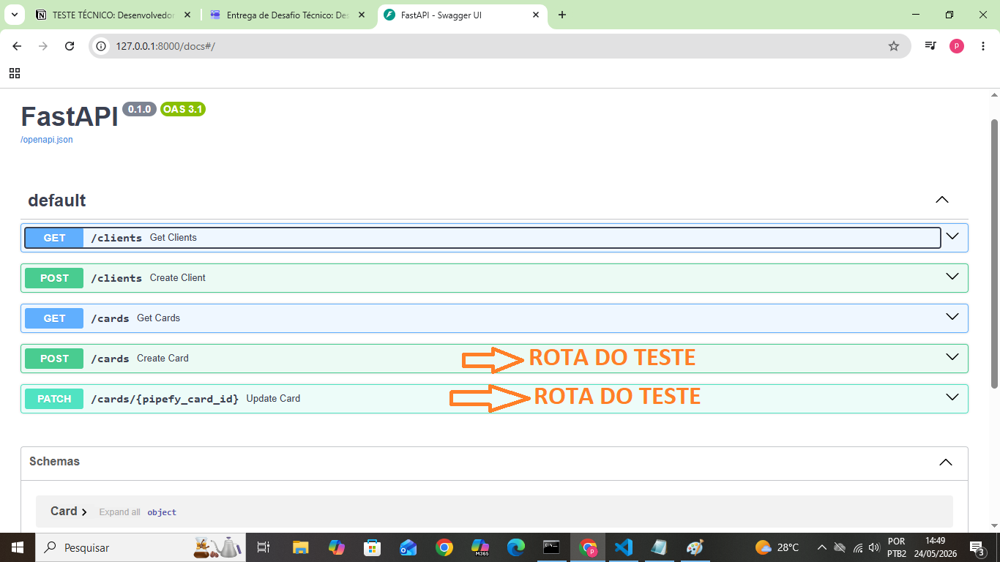

# API Clientes + Cards (FastAPI + SQLite + GraphQL Simulation)

Backend desenvolvido com:

* FastAPI
* SQLite
* Python
* Simulação de integração GraphQL (Pipefy)

---

# 📦 Tecnologias

* Python 3.10+
* FastAPI
* Uvicorn
* SQLite
* GraphQL

---

# 🚀 Como iniciar o projeto

---

## 1. Entre na pasta do projeto e va para a past "api"

Na pasta raiz do projeto abra a pasta api com:

```bash
cd api
```

---

## 2. Crie ambiente virtual

### Windows

```bash
python -m venv venv
```

### Linux/Mac

```bash
python3 -m venv venv
```


## 3. Instale dependências

```bash
python pip install fastapi uvicorn
```
---

# ▶️ Executando aplicação

## Rodar aplicação

```bash
python server.py
```

---

# 📘 Swagger Docs

Após iniciar o servidor:

Acesse:

```txt
http://127.0.0.1:8000/docs
```



---

# 📗 ReDoc

```txt
http://127.0.0.1:8000/redoc
```

---

# 🗄️ Banco SQLite

O banco é criado automaticamente:

```txt
database.db
```

Não é necessário instalar SQLite manualmente.

---

# 📂 Estrutura do projeto

```txt
api/
│
├── server.py
├── graphql_service.py
├── database.db
│
├── schemas/
│   ├── __init__.py
│   └── index.py
│
└── venv/
```

---

# 📌 Endpoints

## Criar cliente

### POST `/clients`

### Payload

```json
{
  "cliente_nome": "Pedro",
  "cliente_email": "pedro@gmail.com",
  "tipo_solicitacao": "Atualização Cadastral",
  "valor_patrimonio": 150000
}
```

---

## Criar card

### POST `/cards`

### Payload

```json
{
  "cliente_email": "pedro@gmail.com",
  "card_name": "Novo Card",
  "nome_cliente": "Pedro",
  "tipo_solicitacao": "Atualização Cadastral",
  "valor_patrimonio": "150000"
}
```

---

## Atualizar card

### PATCH `/cards/{id}`

### Payload

```json
{
  "card_name": "Card Atualizado"
}
```

---

## Listar clientes

### GET `/clients`

---

## Listar cards

### GET `/cards`

---

# 🔥 Funcionalidades

* Persistência local SQLite
* Simulação GraphQL Pipefy
* Criação de cards
* Atualização dinâmica de cards
* Regras de prioridade
* Event ID automático
* Timestamp de atualização
* Relacionamento entre clients e cards

---

# 🧠 Integração GraphQL

A aplicação possui:

* mutation CreateCard
* mutation UpdateCardField

Simulando integração real com Pipefy via GraphQL.

---

# 🛠️ Reiniciar banco

Caso precise resetar banco:

```bash
del database.db
```

Depois reinicie aplicação.

SQLite irá recriar tabelas automaticamente.

---

# 👨‍💻 Autor

Pedro Yago
